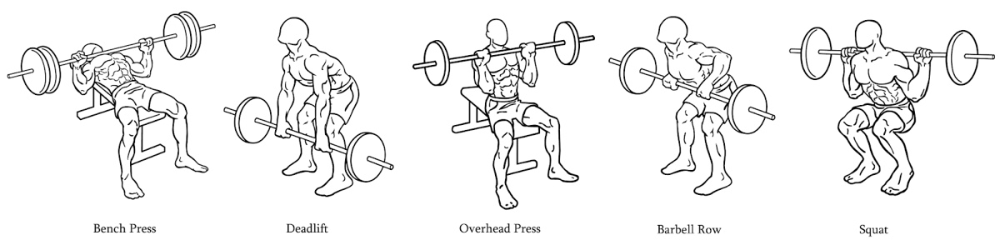
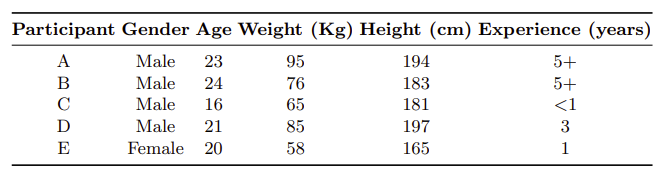

# Tracking barbell exercises

## Overview

The original idea of the idea is taken from the bloom of smart-tracking devices like [Apple Watch](https://www.apple.com/watch/), [Meta Motions](https://mbientlab.com/metamotions/), etc. And while there are activity-recognizing applications, there are still not much applications specifically on gym activities, which are really potential.

This project aim is to create a machine learning model that can classify barbell exercises and count repetitions. 

## The quantified self

The quantified self is any individual engaged in the self-tracking of any kind of biological, physical, behavioral, or environmental information. The self-tracking is driven by a certain goal of the individual, with a desire to act upon the collected information — Hoogendoorn, M., & Funk, B. (2018). Machine learning for the quantified self. On the art of learning from sensory data.

## Barbell exercises




Barbell exercises are weight-training exercises that involve lifting heavy weights loaded onto a barbell. These exercises are typically seen in the gym. 

There are five exercises in this project: Bench Press, Deadlift, Overhead Press, Barbell Row and Quat. 


## About dataset

There are five participants joining in the dataset, which there information in the image below, noticing that Experience column showing the time experience individual has on gym. 



The dataset was collect through a [Meta Motions](https://mbientlab.com/metamotions/) watch, every participants were asked to do a light set and heavy set on the following barbell exercises. 

During each set, the data was collected through Accelerometer and Gyroscope measurement and were saved in different files. For better understanding how these two works, please check out [**docs/Accelerometer-and-Gyroscope.md**](docs/Accelerometer-and-Gyroscope.md).

The time stored in the dataset is written in Unix time. You can read it in [**docs/Working with Unix time**](docs/Working-with-Unix-time.md)


## Process 
1. State the problem, collect data.
2. Preprocessing raw dataset.
3. 


## Installation 
1. Deactivate the current conda environment 
```
conda deactivate
```
2. Create a new environment and download the prerequisite
```
conda env create -f environment.yml
```

3. Check the environment list: 
```
conda env lst
```
4. Activate the environment (make sure the name of the environment is correct): 
```
conda activate tracking-barbell-exercises
```


## License
MIT License 