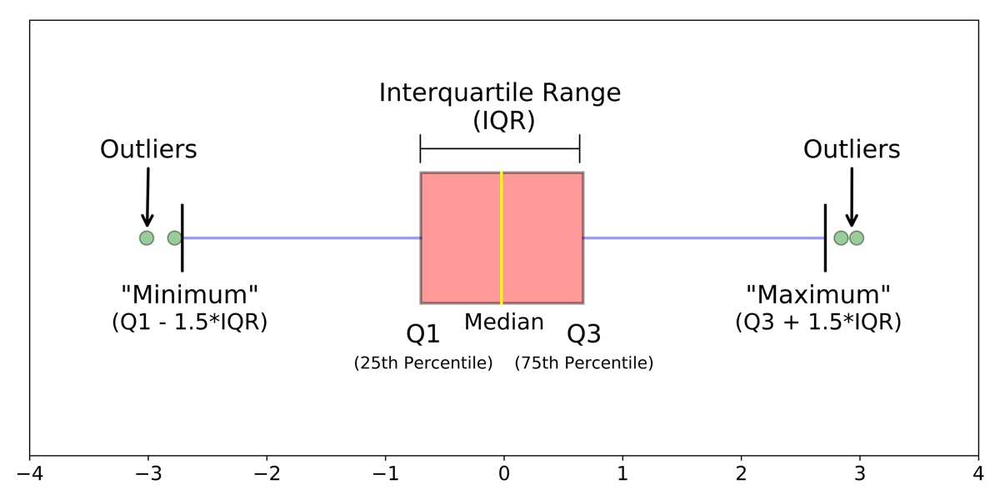

# Boxplot and interquartile range (IQR)

## Pandas Boxplot

A box plot is a method for graphically depicting groups of numerical data through their quartiles. The box extends from the Q1 to Q3 quartile values of the data, with a line at the median (Q2). The whiskers extend from the edges of box to show the range of the data. By default, they extend no more than 1.5 * IQR (IQR = Q3 - Q1) from the edges of the box, ending at the farthest data point within that interval. Outliers are plotted as separate dots.

## Link

[pandas.boxplot](https://pandas.pydata.org/docs/reference/api/pandas.DataFrame.boxplot.html)

[Understanding Boxplots](https://www.kdnuggets.com/2019/11/understanding-boxplots.html)