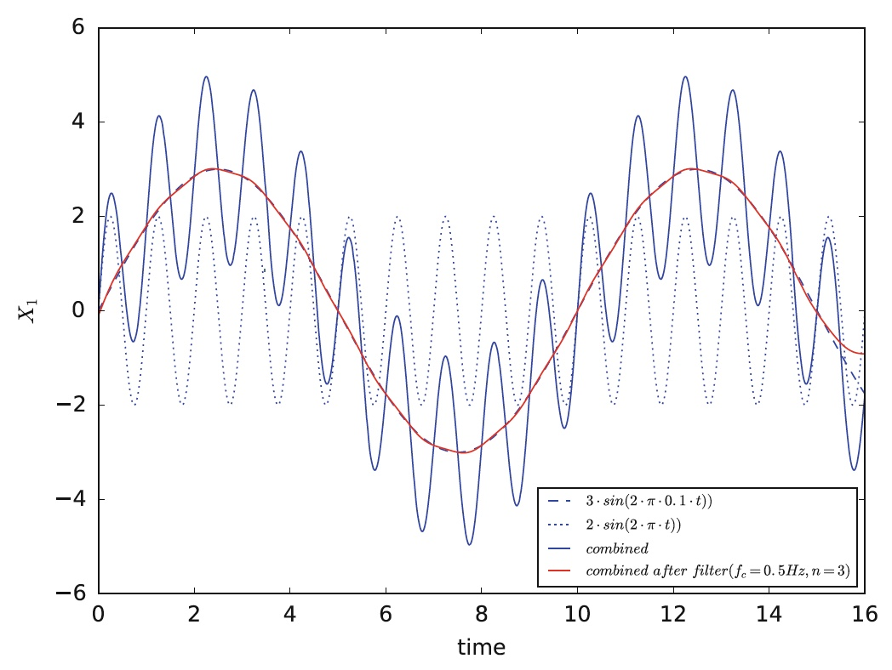

# Butterworth low-pass filter

A Butterworth low-pass filter is a type of filter that is used to remove high frequency noise from a dataset. It is most commonly used in machine learning in order to improve the accuracy of the model. The filter works by removing any data points above a certain threshold frequency, while still preserving the underlying pattern of the data. By doing so, it helps to reduce the effect of noise on the model, which can lead to better results.

Source: Hoogendoorn, M., & Funk, B. (2018). Machine learning for the quantified self. On the art of learning from sensory data.