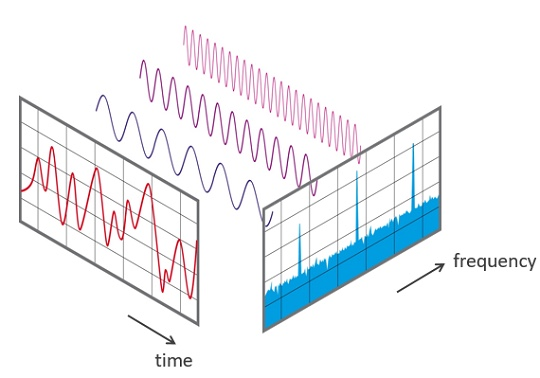

# Discrete Fourier Transformation (DFT)

Discrete Fourier Transformation (DFT)
The idea of a Fourier transformation is that any sequence of measurements we perform can be represented by a combination of sinusoid functions
with different frequencies — Hoogendoorn, M., & Funk, B. (2018). Machine learning for the quantified self. On the art of learning from sensory data.

A DFT is beneficial for Machine Learning, as it can be used to represent data in terms of frequency components, allowing for more efficient analysis of the data. This provides a way to better understand and model complex data sets, as the frequency components produced by the DFT can provide insight into patterns and trends that would not otherwise be visible. Additionally, the DFT can be used to reduce noise, allowing for more accurate models.

Features we will be extracting:

- Amplitude (for each of the relevant frequencies that are part of the time window)

- Max frequency

- Weighted frequency (average)

- Power spectral entropy

[Discrete Fourier transform](https://en.wikipedia.org/wiki/Discrete_Fourier_transform)