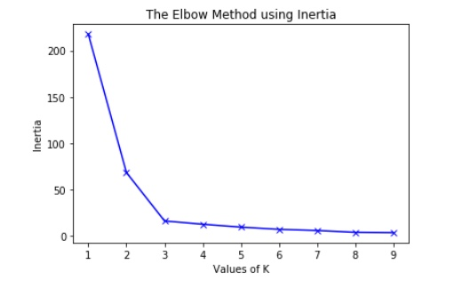

# K-means Clustering
K-means clustering is an unsupervised machine learning algorithm used to group data into clusters based on similarity. It randomly initializes k points (centroids) in the data space, calculates the distance between each data point and each centroid, and assigns each point to its closest centroid. K-means clustering is a popular feature engineering technique used in many applications such as identifying the most important features in a dataset, segmenting customers into different clusters based on their purchase behaviors, anomaly detection, and image compression.

The Elbow Method, also known as the “elbow curve technique”, is used to determine the optimal number of clusters for a given dataset. It plots the Inertia (sum of squared distances of samples to their closest cluster center) for each k (number of clusters) against k and looks for the “elbow” point in the plot; this point represents the optimal number of clusters. The elbow method works by looping through different values of k and calculating the sum of squared errors for each iteration.

[Elbow Method for optimal value of k in KMeans](https://www.geeksforgeeks.org/elbow-method-for-optimal-value-of-k-in-kmeans/)

[sklearn.cluster.KMeans](https://scikit-learn.org/stable/modules/generated/sklearn.cluster.KMeans.html)