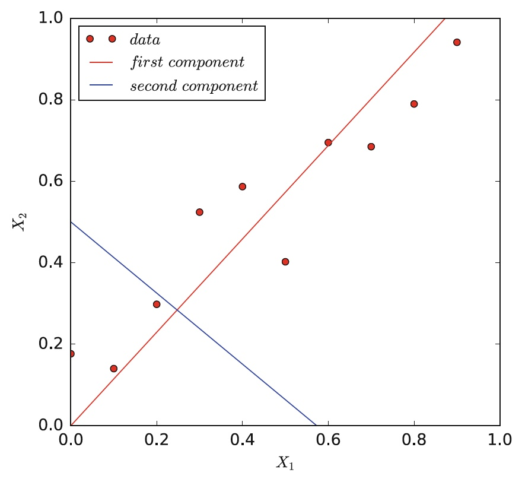

# Principal component analysis (PCA)

PCA is a technique used in machine learning to reduce the complexity of data by transforming the data into a new set of variables called principal components. This transformation is done in such a way that the new set of variables captures the most amount of information from the original data set, while reducing the number of variables necessary. This helps to reduce the complexity of the data and make it easier to analyze and make predictions from.

Source: Hoogendoorn, M., & Funk, B. (2018). Machine learning for the quantified self. On the art of learning from sensory data.

## Elbow technique

The elbow technique is a method used to determine the optimal number of components to use when conducting a PCA. It works by testing multiple different component numbers and then evaluating the variance captured by each component number. The optimal component number is then chosen as the number of components that capture the most variance while also not incorporating too many components. This is done by plotting the variance captured against the component number and then selecting the point at which the rate of change in variance diminishes (the "elbow"), as this is typically the point at which adding more components does not significantly improve the analysis.

## More info 

[Principal component analysis (PCA) - StatQuest](https://www.youtube.com/watch?v=FgakZw6K1QQ)