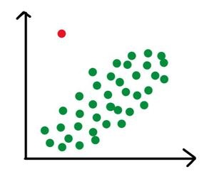
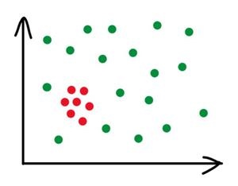
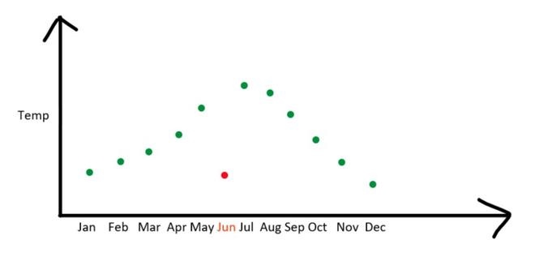

# What are outliers?

An outlier is an extreme value in a data set that is much higher or lower than the majority of the values in the data set. Outliers can be caused by errors in data entry, or extreme variations in the data that are not typical. They can also indicate a discrepancy between the data and the underlying population it represents.

## Problems
Some of the problems that outliers can introduce include skewing the results of statistical analyses, leading to incorrect conclusions about patterns in the data. Outliers can also lead to false interpretations of trends in the data, masking any underlying relationships among the variables. Additionally, outliers can increase the variability in the data, making it more difficult to identify significant patterns or relationships.

Implications on machine learning models
The implications of outliers on machine learning models depend on the type of model being used. Generally speaking, outlier values can have a negative impact on model accuracy and performance. This is because outliers can cause machine learning algorithms to overfit the data, which can lead to poor generalization of the model. Additionally, outliers can bias the model parameters towards the outliers, resulting in inaccurate predictions.

Removing outliers is often necessary in order to improve the accuracy of machine learning models. In some cases, removing outliers can even reduce the computational time required to train the model. Additionally, it is important to monitor for outliers in the data at all times, as these can signal a problem with the data or the underlying process the data represents.

## Types of outliers

- Global
- Collective
- Contextual Outliers

## Link 

[Outliers in data mining](https://www.geeksforgeeks.org/types-of-outliers-in-data-mining/)