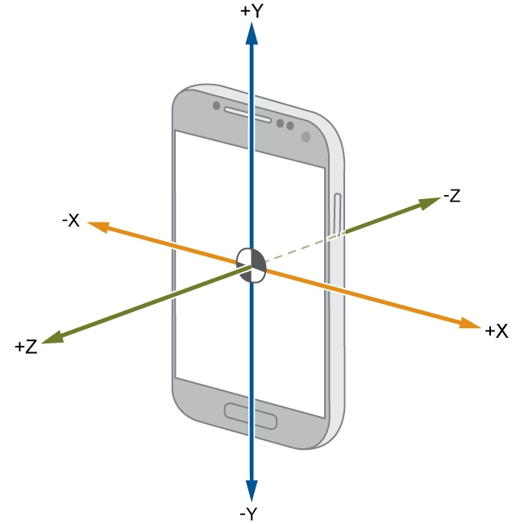
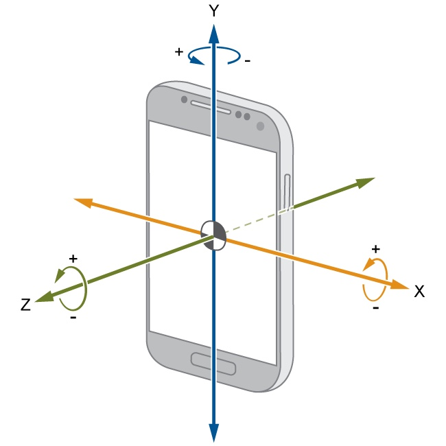

# Understanding accelerometer and gyroscope data

Accelerometer data measured in G-forces (g) — A single G-force for us here on planet Earth is equivalent to 9.8 m/s^2

Gyroscope data measured in degrees/seconds

