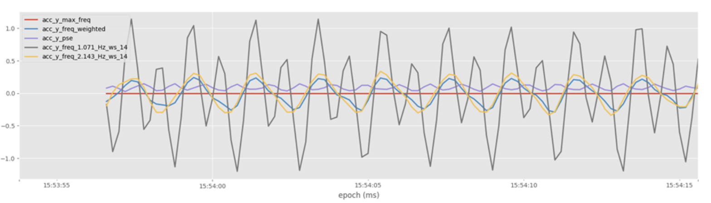
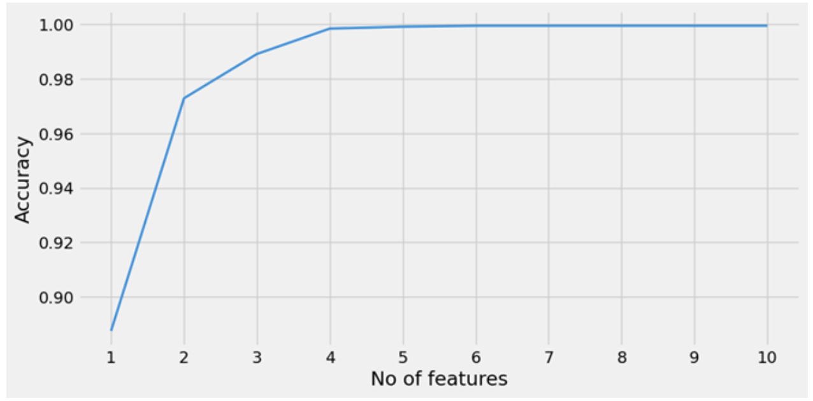

# Project Workflow Report

## Outline 
1. [Business Problem](#business-problem)
2. [Project Objectives](#project-objectives)
3. [Data Preparation](#data-preparation)
4. [Data Processing](#data-processing)
5. [Data Analysis](#data-analysis)
6. [Modelling](#modelling)
7. [Counting Repetitions](#counting-repetitions)

## Business Problem 

### Problem

The management team at a fitness device company is looking to optimize their clients' workout routines and track their progress more effectively. They want to enhance the user experience by accurately predicting the specific barbell exercises performed by the users based on accelerometer and gyroscope data collected from the fitness devices. This predictive tool will enable them to tailor workout plans according to individual needs, monitor exercise consistency, and provide timely feedback to clients for better results, ultimately improving user satisfaction and retention.

### Context 

When a person uses a fitness tracker device they collect data through time, such as data from accelerometer and gyroscope sensors, and it is to be expected that the realization of a specific exercise should result a particular pattern in the data.
- Accelerometer sensor measures acceleration (rate of change of velocity) forces acting on the device along three axes: X, Y, and Z. It can detect movement, tilt, vibration, and changes in speed.
- Gyroscope sensor measures the rate of rotation or angular velocity of the device around its three axes: X, Y, and Z. Provides information and can detect changes about the orientation, angular velocity, and rotational movement of the device.

We can use the data from these sensors to differentiate between barbell exercises, and build a machine learning model to predict which exercise is being performed by a new instance.

In order to maintain customer satisfaction and retention, the company whises to accurately label new instances of barbell training exercises from all clients. This will ensure that our fitness device company builds a good relationship with their customers in the sense of helping them structure and track their training routine.

## Project Objectives

### Objectives

1. Identify exactly which variables contribute to the prediction of barbell exercises.
2. Use feature engineering to perhaps enhance the prediction capabilities of our features.
3. Construct a classification model capable of accurately predicting the probability of the movement being a particular barbell exercise.
4. Offer action plans for the company to avoid mistakes when interpreting the data, to make accurate predictions and preserve customer satisfaction.

### Benefits

1. Development of groundbreaking technologies in fitness tracker devices.
2. Improved customer satisfaction and retention.
3. Improved customer experience.
4. Targeted and competitive marketing.

## Data Preparation

The collected data is of 5 exercises namely Bench Press, Deadlift, Overhead Press, Row, and Squat. The data exported from the accelerometer and gyroscope sensors are in csv format. The representative representative dataset is collected from 5 participants performing barbell exercises in 3 sets of 5 repetitions and 10 repititions. 

Thus there are a total of 150 sets of exercise data and 37 sets of rest data( to examine the state change from rest to exercise) are included. These 187 csv files are a mix of both gyroscope and accelerometer data. Also, the labels have to be extracted from the name of csv file. Hence the data is not highly structured.

## Data Analysis 

Analysis of accelerometer data from the x-axis and z-axis reveals clear distinctions among different exercises.

Gyroscope data seems to be way more uniform than accelerometer, in a way that we would probably only be able to differentiate between exercises by analysing the amplitude and frequency of the signal, and not only its shape.

Not all participants performed all exercises. Number of participants per exercise: Bench Press 5, Squat 5, Overhead Press 4, Barbell Row 4 and Deadlift 3.

After segmenting the data based on exercise type and participant, it is apparent that the accelerometer data shows a markedly higher level of dispersion and distinctiveness than the gyroscope data.

## Data Processing

### Low-pass Filtering

The Butterworth low-pass filter removed some of the high frequency noise in the dataset that might disturb the learning process.

### Principal Component Analysis

A principal component analysis (PCA) was conducted to find the features that could explain most of the variance. PCA was applied to all features excluding the target columns. The results are visualized in the below figure which shows that the explained variance drastically decreases after 3 components. 

Therefore, 3 components are selected and their values are included into the dataset. These 3 components together explain around 95% of the variance in the data.

### Feature Engineering
In feature engineering additional features like aggregated features, temporal abstraction features, frequency domain features,clustering were derived from the exisiting features. For temporal abstraction, rolling window average method is used with a window size of 5. This resulted in highly correlated attributes which can potentially lead to overfitting. Inorder to avoid this, 50% overlap between rows were allowed and the rest of the rows were removed.

Original Signal

Temporal abstraction output

Frequency abstraction output

Clusters

## Modelling

### Initialization

The dataset is now processed and ready for training. The dataset contains the 6 basic features, 2 scalar magnitude features, 3 PCA features, 16 time features, 88 frequency features and 1 cluster feature, summing upto 116 columns. The train test split graph is given below

Train Test Split Graph

Split feature subsets : A total of 116 features were split into different sets namely:

feature_set_1 : basic features feature_set_2 : basic features + square features + pca features feature_set_3: feature_set_2 + time features feature_set_4: feature_set_3 + frequency features + cluster features

Feature selection : Forward feature selection was used to investigate which features contribute the most to performance as useless features could impact the performance of the algorithms. Using a simple decision tree, and gradually adding the best features, the results showed us that after 4 features the performance no longer significantly improved . The best features were stored ina variable named ‘selected features’.

Results of forward feature selection

### Training

Models : First, an initial test runusing GridSearchCV was done to determine the performance of a selection of models and features. This test included the following models: Neural network, Random Forest, Support Vector Machine, K-nearest Neighbours, Decision Tree, Naive Bayes. Grid search was performed on all of the models.

### Results

The results per model can be seen below

Performance of all the models

Random Forest and Neural Network gave best accuracy with feature_set_4. Hence it can be seen that frequency components added to the increased accuracy. Random Forest was further optimized to evaluate the results. Random forest acquired an accuracy of 99% on test data. The confusion matrix is plotted below:

Random Forest confusion matrix

Random Forest Classification report

## Counting Repetitions

Thus Random Forest model could correctly classify the barbell excercises into its respective classes. Another aspect that was explored was counting the repititions of an exercise. To count repetitions, a simple peak counting algorithm was applied to the scalar magnitude acceleration data. To make sure small local peaks were neglected, a strong low-pass filter with a cutoff at 0.4 Hz was applied first. It was found that this method of counting repetitions has to be adjusted to the individual exercises for the best performance. An overall error rate for counting repetitions was about 1% for the collected dataset. An example of 5 benchpress repetitions is shown below:

Actual repititions and predicted repititions for each exercises

